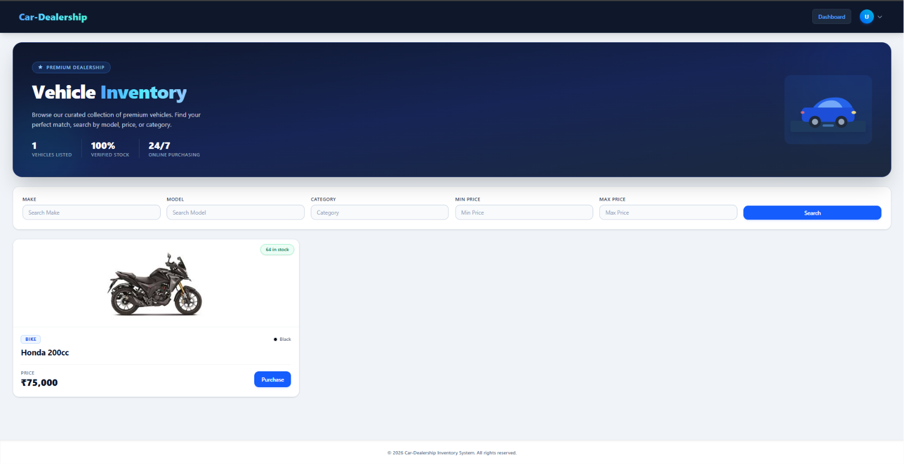
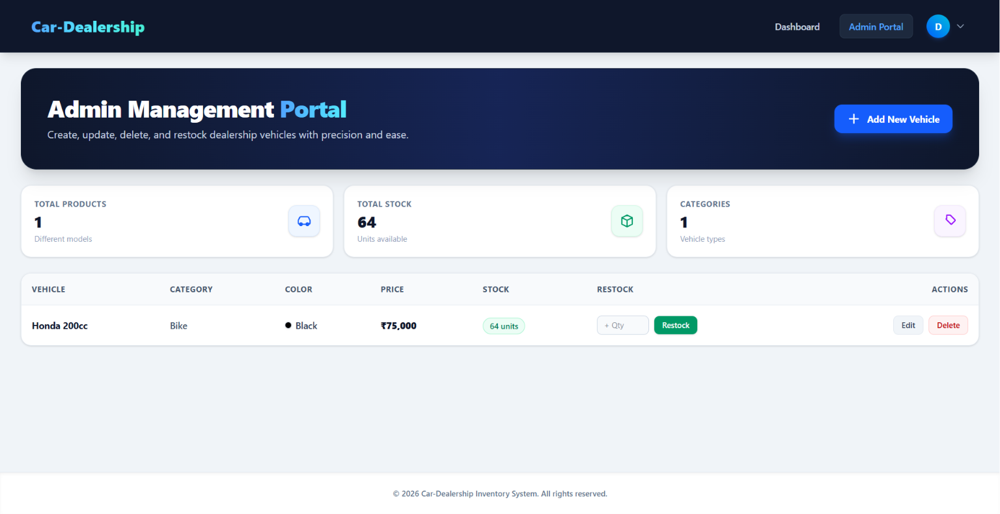
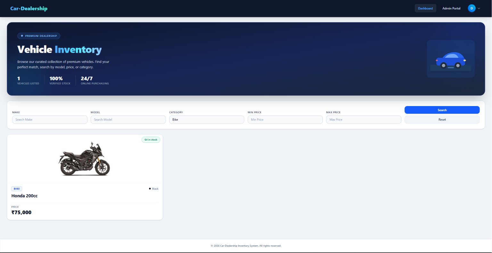
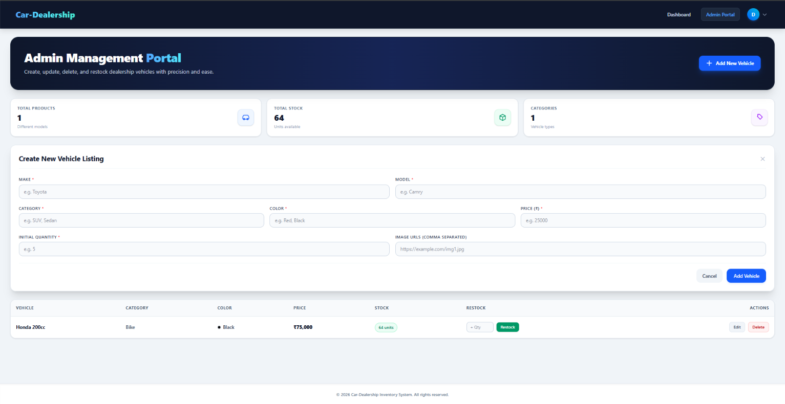

# 🚗 Car Dealership Inventory System

A full-stack **Car Dealership Inventory Management** application built using **Test-Driven Development (TDD)** methodology. Features a **React + Tailwind CSS** frontend and an **Express.js + MongoDB** backend, fully tested with **Jest**, **Supertest**, and **Vitest**.

---

## 🚀 Getting Started

### 1. Clone the Repository

```bash
git clone https://github.com/Dhruvitech/Car-Dealership.git
cd Car-Dealership
```

### 2. Install Backend Dependencies

```bash
cd backend
npm install
```

### 3. Install Frontend Dependencies

```bash
cd ../frontend
npm install
```

---

## 🔐 Environment Variables

Create a `.env` file inside the `backend/` directory:

```env
PORT=3000
MONGO_URI=your_mongodb_connection_string
JWT_SECRET=your_jwt_secret_key
```

> **Tip:** You can use [MongoDB Atlas](https://www.mongodb.com/cloud/atlas) for a free cloud database.

---

## ▶️ Running the Application

### Start the Backend

```bash
cd backend
npm run dev
```

The API will be available at: `http://localhost:3000`

### Start the Frontend

```bash
cd frontend
npm run dev
```

The app will be available at: `http://localhost:5173`

---

## 🧪 Running Tests

### Backend Tests (Jest + Supertest)

```bash
cd backend
npm test
```

### Frontend Tests (Vitest + React Testing Library)

```bash
cd frontend
npx vitest run
```

See [TESTREPORT.md](./TESTREPORT.md) for full test results and coverage.

---

## 📁 Project Structure

```
Car-Dealership/
├── backend/
│   ├── src/
│   │   ├── config/
│   │   │   └── db.js                  # MongoDB connection with pool tuning
│   │   ├── controllers/
│   │   │   ├── authController.js      # Register & login handlers
│   │   │   └── vehicleController.js   # CRUD + purchase + restock handlers
│   │   ├── middleware/
│   │   │   ├── authMiddleware.js      # JWT verification
│   │   │   └── adminMiddleware.js     # Admin role guard
│   │   ├── models/
│   │   │   ├── User.js                # User schema (name, email, password, role)
│   │   │   └── Vehicle.js             # Vehicle schema with DB indexes
│   │   ├── routes/
│   │   │   ├── authRoutes.js          # /api/auth/*
│   │   │   └── vehicleRoutes.js       # /api/vehicles/*
│   │   ├── services/
│   │   │   ├── authService.js         # Registration & login business logic
│   │   │   └── vehicleService.js      # Vehicle CRUD, search, purchase, restock
│   │   ├── tests/
│   │   │   ├── auth.test.js           # Registration & login integration tests
│   │   │   ├── vehicle.test.js        # Vehicle CRUD integration tests
│   │   │   ├── search.test.js         # Search endpoint integration tests
│   │   │   ├── purchase.test.js       # Purchase endpoint integration tests
│   │   │   ├── restock.test.js        # Restock endpoint integration tests
│   │   │   ├── middleware.test.js     # JWT middleware unit tests
│   │   │   └── admin.test.js          # Admin middleware unit tests
│   │   ├── app.js                     # Express app setup (cors, compression)
│   │   └── server.js                  # Server entry point
│   ├── .env                           # Environment variables (not committed)
│   └── package.json
│
├── frontend/
│   ├── src/
│   │   ├── api/
│   │   │   └── axios.js               # Axios instance (timeout, interceptors)
│   │   ├── components/
│   │   │   ├── Layout.jsx             # App shell (Navbar + conditional footer)
│   │   │   ├── Navbar.jsx             # Navigation with profile dropdown & logout
│   │   │   ├── ProtectedRoute.jsx     # Auth + role guards
│   │   │   ├── VehicleCard.jsx        # Vehicle display card with purchase button
│   │   │   └── VehicleForm.jsx        # Add/Edit vehicle form (admin)
│   │   ├── context/
│   │   │   └── AuthContext.jsx        # Global auth state (token, user, role)
│   │   ├── pages/
│   │   │   ├── Login.jsx              # Login page
│   │   │   ├── Register.jsx           # Registration page (role selector)
│   │   │   ├── Dashboard.jsx          # User inventory view (search, purchase)
│   │   │   ├── AdminDashboard.jsx     # Admin portal (add, edit, delete, restock)
│   │   │   └── NotFound.jsx           # 404 page
│   │   ├── routes/
│   │   │   └── AppRoutes.jsx          # Route definitions + guards
│   │   └── tests/
│   │       ├── Admin.test.jsx         # Admin dashboard component tests
│   │       ├── Dashboard.test.jsx     # Inventory dashboard component tests
│   │       ├── Purchase.test.jsx      # Purchase flow component tests
│   │       ├── Search.test.jsx        # Search functionality component tests
│   │       └── Register.test.jsx      # Registration form component tests
│   ├── index.html
│   ├── vite.config.js
│   └── package.json
│
├── screenshots/                       # UI application screenshots & previews
│   ├── admin-dashboard.png            # Admin inventory table view
│   ├── admin-portal.png               # Admin portal header overview
│   ├── admin-vehical-add.png          # Add/Edit vehicle listing modal
│   └── userdashbord.png               # User vehicle inventory dashboard
│
├── PROMPTS.md                         # Full AI chat history and prompts used
├── TESTREPORT.md                      # Complete test results and coverage
└── README.md
```

---

## 🔗 API Reference

### Auth Endpoints

| Method | Endpoint | Description | Auth |
|--------|----------|-------------|------|
| `POST` | `/api/auth/register` | Register a new user (user or admin role) | Public |
| `POST` | `/api/auth/login` | Login and receive JWT token | Public |

### Vehicle Endpoints

| Method | Endpoint | Description | Auth |
|--------|----------|-------------|------|
| `POST` | `/api/vehicles` | Add a new vehicle | 🔒 JWT |
| `GET` | `/api/vehicles` | List all vehicles | 🔒 JWT |
| `GET` | `/api/vehicles/search` | Search by make, model, category, price range | 🔒 JWT |
| `PUT` | `/api/vehicles/:id` | Update vehicle details | 🔒 JWT |
| `DELETE` | `/api/vehicles/:id` | Delete a vehicle | 🔒 Admin only |
| `POST` | `/api/vehicles/:id/purchase` | Purchase a vehicle (decrements stock) | 🔒 JWT |
| `POST` | `/api/vehicles/:id/restock` | Restock a vehicle (increments stock) | 🔒 Admin only |

### Vehicle Data Model

| Field | Type | Required | Notes |
|-------|------|----------|-------|
| `make` | String | ✅ | e.g., "Toyota" |
| `model` | String | ✅ | e.g., "Camry" |
| `category` | String | ✅ | e.g., "Sedan", "SUV" |
| `price` | Number ≥ 0 | ✅ | In USD |
| `quantity` | Number ≥ 0 | ✅ | Stock count |
| `color` | String | ✅ | e.g., "Silver" |
| `images` | String[] | ❌ | Array of image URLs |

---

## 🔍 Key Features

- **Role-based registration** — select Customer (user) or Dealership Manager (admin) on sign-up
- **JWT-protected routes** — all vehicle endpoints require a valid Bearer token
- **Admin-only guards** — Delete and Restock are protected by a dedicated `adminMiddleware`
- **Smart navigation** — after login/register, users are routed to their appropriate dashboard
- **Search & filter** — filter vehicles by make, model, category, and min/max price range
- **Blank search blocked** — search requires at least one field; empty submits show a warning
- **Purchase flow** — Purchase button disabled when quantity is zero; stock decrements atomically
- **Optimistic UI updates** — Admin edits, deletes, and restocks update state locally without re-fetching
- **Performance** — DB indexes, `.lean()` queries, gzip compression, 30s `sessionStorage` cache on frontend
- **Responsive design** — works cleanly on mobile and desktop

---

## 🎨 UI Preview / Screenshots

### 1. User Vehicle Inventory Dashboard
> Browse available dealership inventory, search by make, model, category, or price range, and purchase vehicles.



---

### 2. Admin Management Portal Overview
> Executive dashboard header for dealership administrators showing high-level stats and management tools.



---

### 3. Admin Inventory Table & Stock Actions
> Table view for admins to inspect vehicle stock, edit details, delete listings, and restock inventory.



---

### 4. Add / Edit Vehicle Listing Form
> Clean modal dialog for adding new vehicle inventory or modifying existing listing details.



---

## 🧪 TDD — Red-Green-Refactor Workflow

This project strictly follows the **Red → Green → Refactor** cycle:

| Phase | Description |
|-------|-------------|
| 🔴 **Red** | Write failing tests for the feature (no implementation yet) |
| 🟢 **Green** | Write the minimum code needed to make tests pass |
| ♻️ **Refactor** | Clean up, apply SOLID principles, improve readability |

Each phase is committed separately with a clear label (`RED`, `GREEN`, `♻️`) in the commit history so the TDD journey is fully traceable.

---

## 🤖 My AI Usage

This section is mandatory per the assessment's AI Co-authorship Policy.

### Tools Used

| Tool | Role |
|------|------|
| **Antigravity (Google DeepMind)** | Primary assistant — backend logic, frontend components, test scaffolding, debugging, refactoring, performance tuning |
| **GitHub Copilot** | Inline autocompletion for boilerplate and repetitive patterns |

### How I Used AI

- **Test generation** — Asked Antigravity to generate initial Jest/Supertest test structures for each backend endpoint (auth, CRUD, search, purchase, restock) and Vitest/RTL tests for each frontend component. Manually reviewed, corrected assertions, and verified that each test *correctly fails* in the Red phase before writing implementation.
- **Backend service logic** — Used AI to brainstorm the `VehicleService` class structure and the `buildSearchQuery` helper. Manually added validation boundaries, HTTP status codes, and error messages.
- **Frontend components** — Used AI to scaffold `VehicleCard`, `VehicleForm`, and `AdminDashboard`. Manually refined UX interactions, ARIA accessibility labels, and state management patterns.
- **Performance tuning** — AI identified 10 specific bottlenecks (missing DB indexes, no `.lean()` on read queries, no gzip compression, no frontend caching). Reviewed and approved each fix before applying.
- **Debugging** — Used AI to trace failing tests (e.g., `sessionStorage` leaking between Vitest tests, `act()` warnings from async state updates). Applied targeted, understood fixes rather than blindly copying suggestions.
- **prompts** are logged chronologically in [`PROMPTS.md`](./PROMPTS.md).

### My Reflection

AI dramatically accelerated my ability to follow TDD properly — especially writing thorough failing tests *before* implementation. Without AI assistance, I would have been tempted to skip tests or write them post-implementation. AI helped me think of edge cases I might have missed (expired JWT, tampered token signature, out-of-stock purchase attempt, blank search submission). However, AI-generated code always required careful review — it sometimes produced tests that were too permissive, or implementation that bypassed validation. The discipline of reading, understanding, and intentionally committing every change remained entirely mine.

---

## 👩‍💻 Author

**Dhruvi** — [GitHub](https://github.com/Dhruvitech)

---